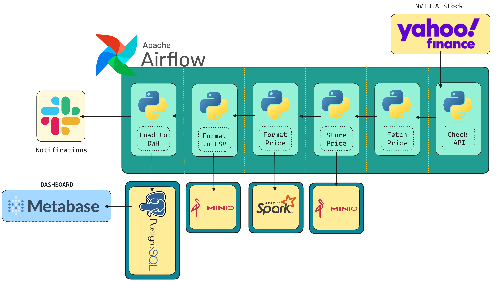

### ETL Pipeline - NVIDIA Stock Performance : A Two-Year Review

- **Data Stack**
  - Orchestration = Apache Airlow
  - Data Transformation = Apache Spark
  - OLAP/Data Warehouse = Minio & PostgreSQL
  - Dashboard = Metabase

#### A. System Design

#### B. Airflow Graph

#### C. Postgres Data Warehouse

#### D. Metabase Dashboard 

#### E. Slack Notification 
1. Setup Slack Token -> https://api.slack.com/apps
2. Airflow Dashboard -> Admin -> Connection -> Slack API
3. add on_failure_callback and on_success_callback on your own DAG
4. Documentation -> https://airflow.apache.org/docs/apache-airflow-providers-slack/stable/notifications/index.html

